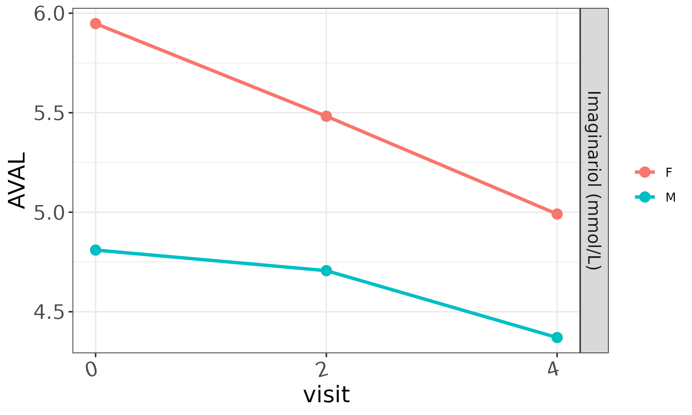
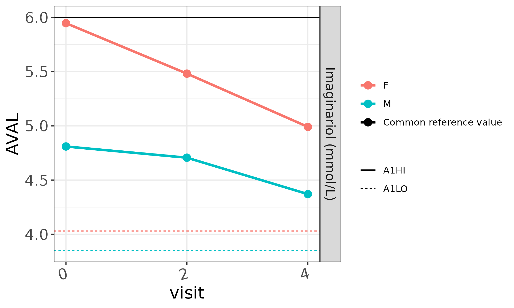
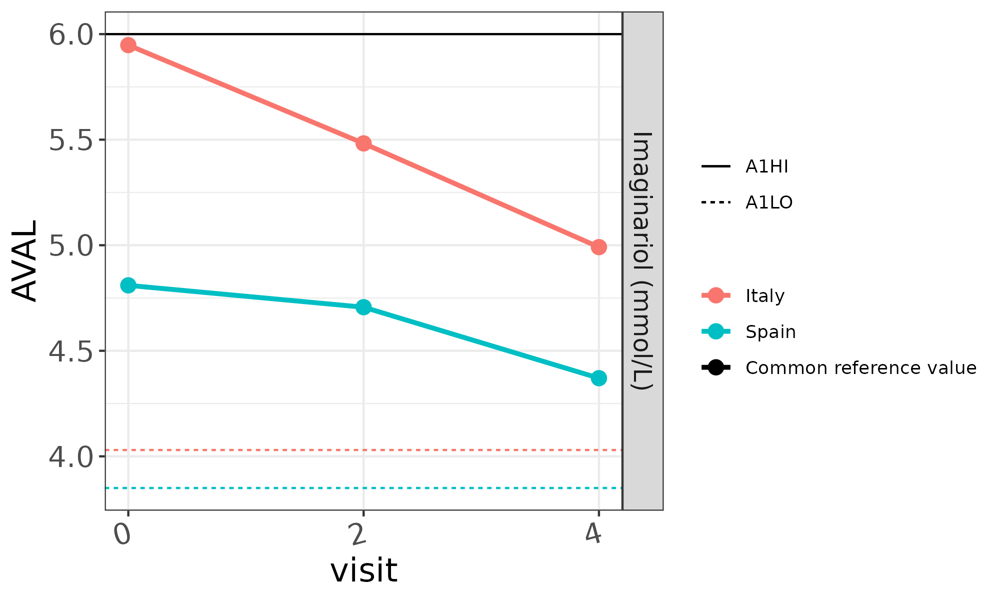
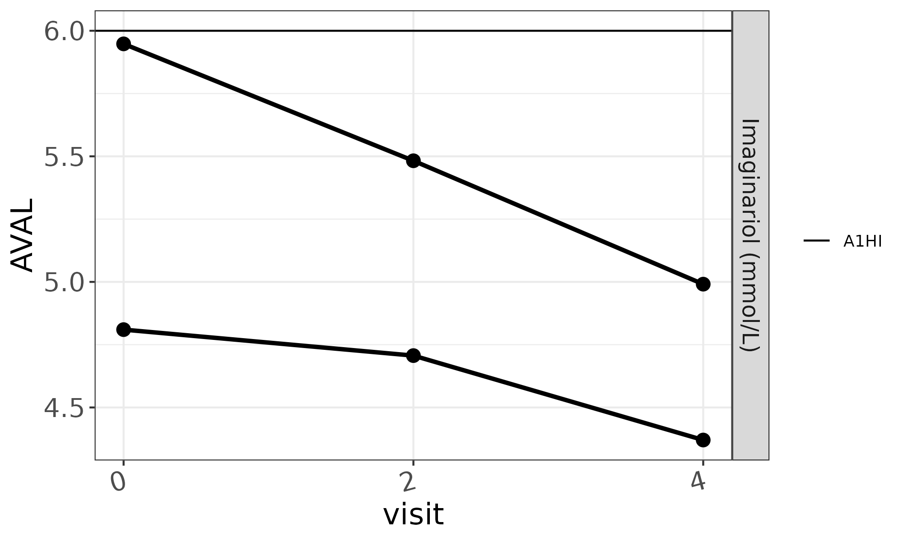
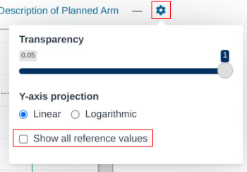
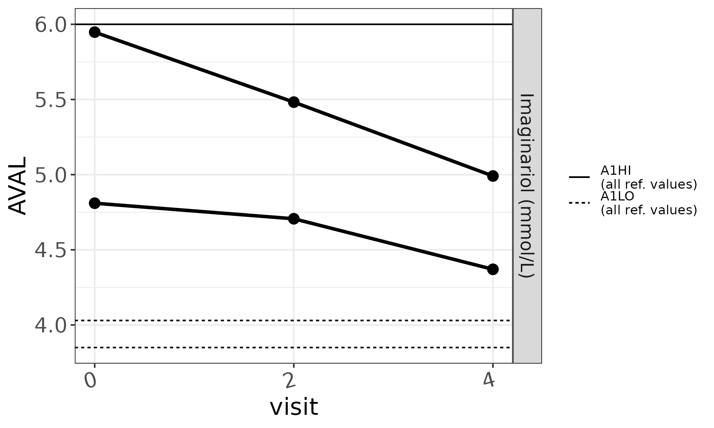
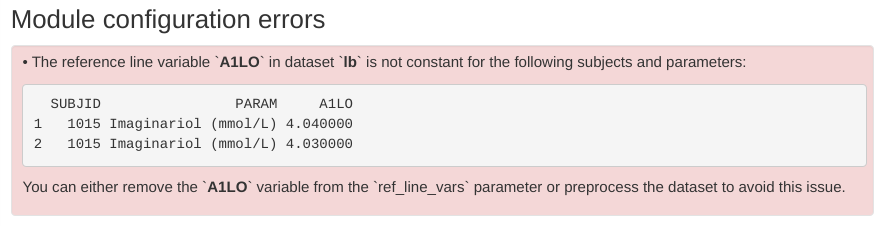

# Lineplot reference values

This article describes how to display reference values in `mod_lineplot`
charts and discusses the behavior of reference lines in the presence of
grouped data.

## A basic plot

As a starting point, let’s imagine we want to inspect the following toy
subject-level (`sl`) and laboratory values (`lb`) datasets:

Subject-level dataset *\[expand/collapse\]*

| SUBJID | SEX | RACE  | COUNTRY |
|:-------|:----|:------|:--------|
| 1015   | F   | WHITE | Italy   |
| 1028   | M   | WHITE | Spain   |

Laboratory values dataset *\[expand/collapse\]*

| SUBJID | PARCAT1 | PARAM                | AVISITN |    AVAL | A1LO | A1HI |
|:-------|:--------|:---------------------|--------:|--------:|-----:|-----:|
| 1015   | CHEM    | Imaginariol (mmol/L) |       0 | 5.94780 | 4.03 |    6 |
| 1015   | CHEM    | Imaginariol (mmol/L) |       2 | 5.48232 | 4.03 |    6 |
| 1015   | CHEM    | Imaginariol (mmol/L) |       4 | 4.99098 | 4.03 |    6 |
| 1028   | CHEM    | Imaginariol (mmol/L) |       0 | 4.80996 | 3.85 |    6 |
| 1028   | CHEM    | Imaginariol (mmol/L) |       2 | 4.70652 | 3.85 |    6 |
| 1028   | CHEM    | Imaginariol (mmol/L) |       4 | 4.37034 | 3.85 |    6 |

We can do so by configuring `mod_lineplot` thus:

``` r

dv.explorer.parameter::mod_lineplot(
  module_id = "lineplot", bm_dataset_name = "lb", group_dataset_name = "sl",
  subjid_var = "SUBJID", cat_var = "PARCAT1", par_var = "PARAM", 
  value_vars = "AVAL", visit_vars = "AVISITN", default_cat = "CHEM", 
  default_par = "Imaginariol (mmol/L)", default_main_group = "SEX"
)
```

Which generates the following plot: 

## Grouped and ungrouped reference values

We can modify that call to `mod_lineplot` by providing a value for the
`ref_line_vars` parameter so that it points to one or more `lb`
numerical columns holding reference values:

``` r

dv.explorer.parameter::mod_lineplot(
  ..., default_main_group = "SEX", ref_line_vars = c("A1LO", "A1HI")
)
```

Which produces:  Examining this
plot, we can see the three distinct reference values available in the
original `bm` dataset. There is one `A1HI` value common to our two
subjects. It’s indicated with a continuous black line. There are also
two `A1LO` values that coincide with our selected grouping. Since the
plot already provides colors for the “female” and “male” categories,
`mod_lineplot` paints those lines in matching colors.

## Which demographic variable dictates distinct reference values?

The original `bm` dataset does not explain which variable leads to
subjects having different `A1LO` reference values. One of the two
subjects has a `A1LO` value of 3.85 while the other has one of 4.03.
It’s likely that `SEX` is the variable that justifies the difference.
However, given the totality of the data, `COUNTRY` would work just as
well. If we change the main grouping to `COUNTRY`, the plot remains the
same except for the grouping legend:

``` r

dv.explorer.parameter::mod_lineplot(
  ..., default_main_group = "COUNTRY", ref_line_vars = c("A1LO", "A1HI")
)
```



This plot is still factually correct in the sense that the color of each
`AVAL` line is color-matched with the `A1LO` value that shares the same
row in the `lb` dataset.

## Disappearing reference lines

What happens if we don’t provide a main grouping variable?

``` r

dv.explorer.parameter::mod_lineplot(
  ..., ref_line_vars = c("A1LO", "A1HI")
)
```

In this case, `mod_lineplot` can’t use color to pair the `A1LO`
reference lines to the `AVAL` lines, so the reference lines are omitted:



Notice, however, that the `A1HI` value still applies to both black
`AVAL` lines, so it is kept.

## Displaying all reference values

Sometimes it’s useful to see *all* reference values regardless of
whether they can be represented truthfully under some particular data
grouping. To do that, users can override the built-in reference line
filter by checking the “Show all reference values” option under the
“Settings” drop-down menu.



If we do that, all unique reference values are shown. The legend entries
are also modified to point out the non-standard nature of the plot.



## Requirements for reference values

All reference value variables assigned to `ref_line_vars` should:

- be numerical
- remain constant across every combination of subject and parameter of
  the dataset

If one of these conditions is not met during module start-up,
`mod_lineplot` will produce a suitable error message, such as:


