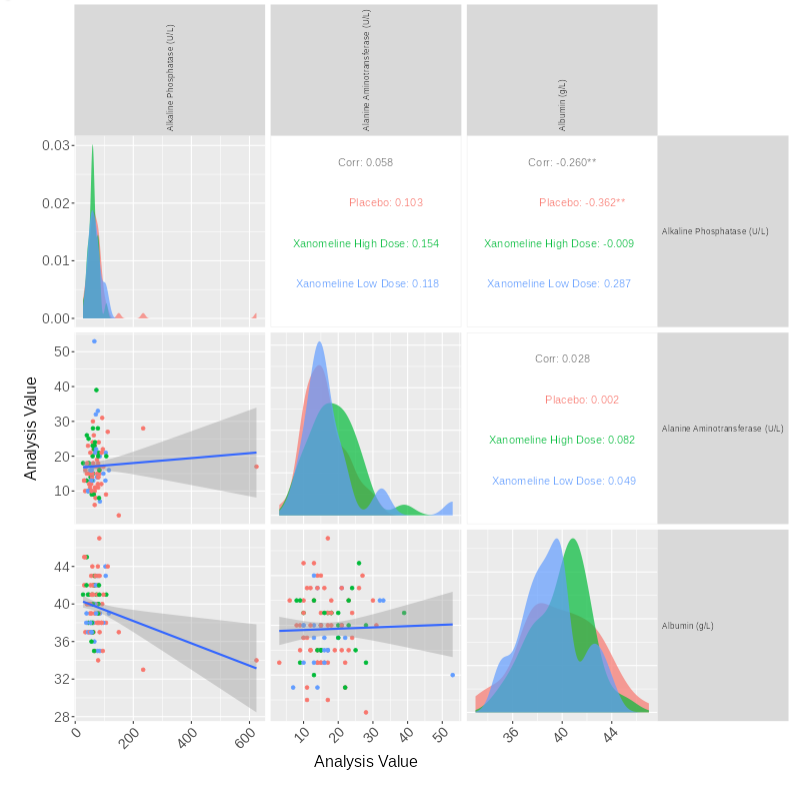
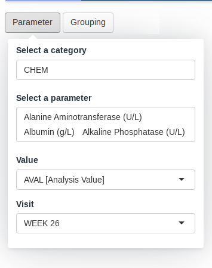
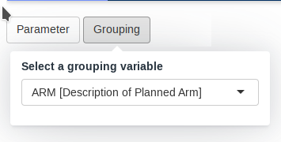

# Matrix of Scatterplots module



This guide provides a detailed overview of the `scatterplotmatrix`
module and its features. It is meant to provide guidance to App Creators
on creating Apps in DaVinci using the `scatterplotmatrix` module.
Walk-throughs for sample app creation using the module are also included
to demonstrate the various module specific features.

The `boxplotscatterplotmatrix` module makes it possible to visualize a
matrix of scatterplots of parameters that also includes correlation
stats.

#### Pre-requisite:

\

**“Parameter” Term Disambiguation**

The guide uses the term **“parameter”** at several places. This term in
the guide represents clinical analysis parameters and values such as
laboratory values, safety values, etc as used in the clinical dataset
context. This can be confused with the word parameter as used in a
programming context - “parameters of a function”. Therefore, to fully
disambiguate the usage in this guide:

- **Parameter** is used exclusively in the clinical dataset context
- **Argument** is used to represent parameter of a function in the
  programming context

\

## Features

`scatterplotmatrix` features the following plot and tables:

- A matrix of scatterplots with some correlation statistics.

It supports bookmarking.

## Arguments for the module

[`dv.explorer.parameter::mod_scatterplotmatrix()`](../reference/mod_scatterplotmatrix.md)
module uses several arguments with the following being mandatory and the
rest optional. As part of app creation, the app creator should specify
the values for these arguments as applicable.

**Mandatory Arguments**

- `module_id` : A unique identifier of type character for the module in
  the app.

- `subjid_var`: A common column across all datasets that uniquely
  identify subjects. By default: “SUBJID”

- `bm_dataset_name`: The dataset that contains the continuous
  parameters. It expects a dataset similar to
  <https://www.cdisc.org/kb/examples/adam-basic-data-structure-bds-using-paramcd-80288192>
  , 1 record per subject per parameter per analysis visit

  It expects, at least, the columns passed in the arguments,
  `subjid_var`, `cat_var`, `par_var`, `visit_var` and `value_vars`.

- `group_dataset_name`:

  It expects a dataset with an structure similar to
  <https://www.cdisc.org/kb/examples/adam-subject-level-analysis-adsl-dataset-80283806>
  , one record per subject It expects to contain, at least, `subjid_var`

Refer to
[`dv.explorer.parameter::mod_scatterplotmatrix()`](../reference/mod_scatterplotmatrix.md)
for the complete list of arguments and their description.

## Input menus

|                                |                                |
|--------------------------------|--------------------------------|
|  |  |

A set of menus allows to select a set of parameters and grouping.

## Visualizations

### A matrix of scatterplots

This visualizations consists of a matrix of scatterplots with
correlation statistics.


## Creating a scatterplotmatrix application

``` r

adbm_dataset <- dv.explorer.parameter:::safety_data()[["bm"]]
adsl_dataset <- dv.explorer.parameter:::safety_data()[["sl"]]

dv.manager::run_app(
  data = list(dummy = list(adbm = adbm_dataset, adsl = adsl_dataset)),
  module_list = list(
    "Scatterplot Matrix" = dv.explorer.parameter::mod_scatterplotmatrix(
      "scatterplotmatrix",
      bm_dataset_name = "adbm",
      group_dataset_name = "adsl",
      cat_var = "PARCAT1",
      par_var = "PARAM",
      value_vars = "AVAL",
      visit_var = "AVISIT",
      subjid_var = "USUBJID"
    )
  ),
  filter_data = "adsl",
  filter_key = "USUBJID"
)
```
