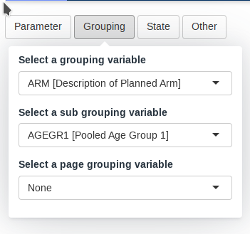
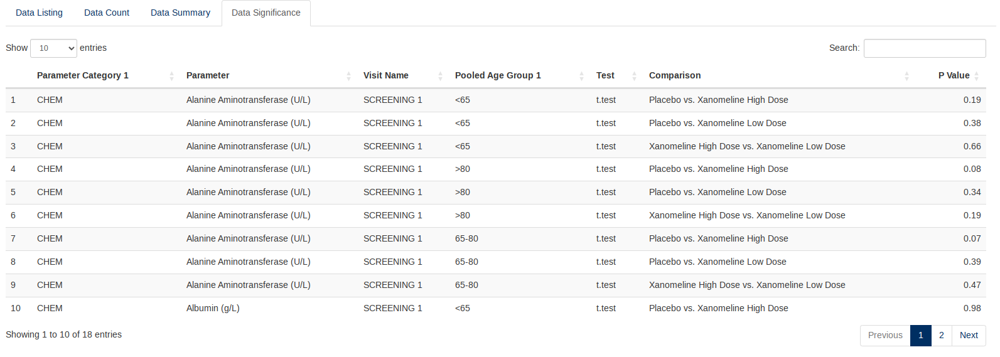

```{r, include = FALSE}
knitr::opts_chunk$set(
  collapse = TRUE,
  comment = "#>"
)
```


This guide provides a detailed overview of the `boxplot` module and its features. It is meant to provide guidance to
App Creators on creating Apps in DaVinci using the `boxplot` module.
Walk-throughs for sample app creation using the module are also included
to demonstrate the various module specific features.

The `boxplot` module makes it possible to visualize a boxplot chart of parameters, and several tables with
population listings, summary statistics and between group stat comparisons.


```{r include_child, child = '_common/_info.Rmd'}
```

# Features

`boxplot` features the following plot and tables:

-   A set of boxplot/violin charts with different custom groupings and optionally showing the individual data points.
-   A table showing the population listing of the selected boxplot
-   A table showing the number of subjects per boxplot
-   A table showing the number of subjects per boxplot and addition stats on the parameter value distribution
-   A table containing a set of statistical tests comparing the mean parameter value between groups

It supports bookmarking.

# Arguments for the module

`dv.explorer.parameter::mod_boxplot()`
module uses several arguments with the following being mandatory and
the rest optional. As part of app creation, the app
creator should specify the values for these arguments as applicable.

**Mandatory Arguments**

-   `module_id` : A unique identifier of type character for the module
    in the app.

-   `subjid_var`: A common column across all datasets that uniquely identify subjects. By default: "USUBJID"

-   `bm_dataset_name`: The dataset that contains the continuous parameters. It expects a dataset similar to
     https://www.cdisc.org/kb/examples/adam-basic-data-structure-bds-using-paramcd-80288192 ,
     1 record per subject per parameter per analysis visit

    It expects, at least, the columns passed in the arguments,
    `subjid_var`, `cat_var`, `par_var`, `visit_var` and `value_vars`.    

-  `group_dataset_name`: 

    It expects a dataset with an structure similar to https://www.cdisc.org/kb/examples/adam-subject-level-analysis-adsl-dataset-80283806 , one record per subject
    It expects to contain, at least, `subjid_var`

Refer to `dv.explorer.parameter::mod_boxplot()` for the complete list of arguments and their description.

# Input menus

  |  |  
--|--|--
 |  | 

A set of menus allows to select a set of parameters, groupings and settings of the visualization.

# Visualizations

## Boxplot

This visualizations consists of a facetted boxplot plot based on the set of parameters and grouping variable.


# Tables

## Population listing and single listing

A table containing a listing of the population of a single boxplot selected by clicking, and a table containing a
single subject selected by double clicking on an individual data point in the boxplot.

The single subject table contains a drill down button that can be used to obtain more information about the subject.
This setting requires additional configuration.


## Count table

A table containing the number of subjects per boxplot.


## Summary table

A table containing a set of summary statistics per boxplot.


## Significance table

A table containing a set of statistical tests comparing the means of different groups.



# Creating a boxplot application

```{r, eval=FALSE}
adbm_dataset <- dv.explorer.parameter:::safety_data()[["bm"]] |>
  dplyr::mutate(
    USUBJID = factor(USUBJID),
    PARCAT1 = factor(PARCAT1),
    PARAM = factor(PARAM),
    AVISIT = factor(AVISIT)
  )

adsl_dataset <- dv.explorer.parameter:::safety_data()[["sl"]] |>
  dplyr::mutate(USUBJID = factor(USUBJID))

dv.manager::run_app(
  data = list(dummy = list(adbm = adbm_dataset, adsl = adsl_dataset)),
  module_list = list(
    Boxplot = dv.explorer.parameter::mod_boxplot(
      "boxplot",
      bm_dataset_name = "adbm",
      group_dataset_name = "adsl",
      cat_var = "PARCAT1",
      par_var = "PARAM",
      value_vars = c("AVAL", "CHG"),
      visit_var = "AVISIT",
      subjid_var = "USUBJID"
    )
  ),
  filter_data = "adsl",
  filter_key = "USUBJID"
)
```

# Drill down functionality

This module allows passing the `subject_id` to another module for further drill down when the *View Details* button is
pressed.
