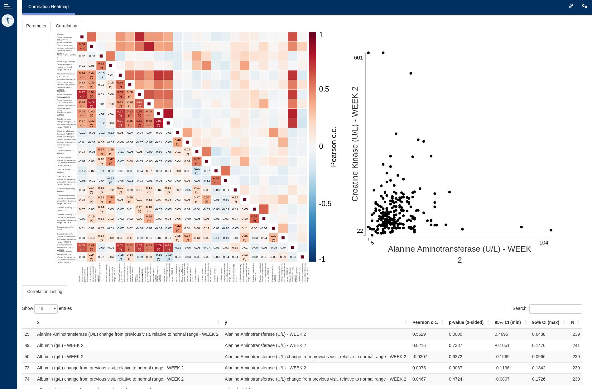
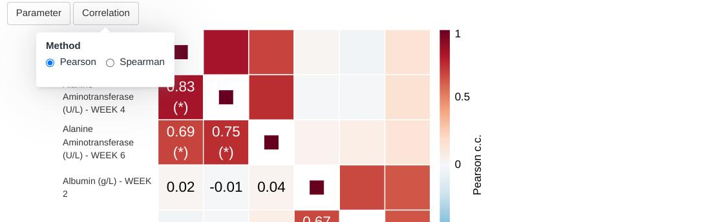
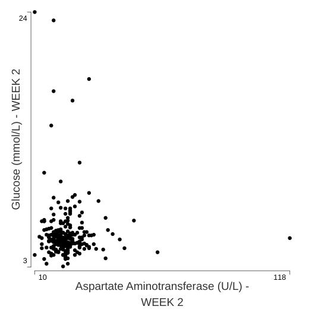

```{r, include = FALSE}
knitr::opts_chunk$set(
  collapse = TRUE,
  comment = "#>"
)
```




This guide provides guidance on creating Apps in DaVinci using the `correlation heatmap` module.
Walk-throughs for sample app creation are also included to demonstrate various module-specific features.

The `correlation heatmap` module displays a heatmap of correlation coefficients (Pearson, Spearman) 
along with confidence intervals and p-values between pairs of dataset parameters over a single visit.

```{r include_child, child = '_common/_info.Rmd'}
```

# Features

The `correlation heatmap` module offers the following features:

-   Heatmap of correlations, with numerical coefficients overlayed on top and statistical significance denoted by asterisks.
-   Listing expanding the correlation information with confidence intervals and p-values.
-   Basic interactive drill-down scatter plot to examine combinations of pairs of parameters present on the heatmap.

This module supports bookmarking.

# Module arguments

```{r, echo = FALSE}
corr_hm_call <- paste0("`", devtools::as.package(".")$package, "::mod_corr_hm()`")
```

The `r corr_hm_call` module presents mandatory and optional function arguments to the app creator.

**Mandatory Arguments**

-   `module_id` : A unique identifier of type character for the module in the app.

-   `bm_dataset_name`: The dataset that contains the continuous parameters. It expects a dataset similar to
     https://www.cdisc.org/kb/examples/adam-basic-data-structure-bds-using-paramcd-80288192 ,
     1 record per subject per parameter per analysis visit.

    It should have, at least, the columns passed in the optional arguments,
    `subjid_var`, `cat_var`, `par_var`, `visit_var` and `value_vars`.    

Refer to `r corr_hm_call` for the complete list of arguments and their description.

# Input menus

The module offers to drop-down menus. The first one allows to select parameters and visits for the visualization.
On each of its rows, the user can select a combination of parameters, belonging to one or more categories, over
one or more visits. New rows appear every time a row is complete, allowing to mix parameters and visits in a flexible
manner.

The final selection can be described as the union of the cartesian product of the elements selected on each row.

 

The second drop-down allows to pick one of the two built-in correlation methods.



# Visualizations

## Correlation Heatmap

This is the main plot. It consists of a diagonally symmetrical heatmap of correlation coefficients.
The lower-left triangle of the heatmap displays rounded coefficient values an highlights statistically 
significant coefficients using asterisks. Clicking any one of the squares brings up a scatter plot of 
the two variables that intersect on that square.

Rounding is mathematical (round-to-even) with two decimals. Significance is based on a 2-sided, uncorrected for
multiple comparisons p-value.


## Scatter plot

This secondary plot provides a basic overview of the shape of the data that contributes to a particular
correlation coefficient. It is intentionally limited in its intent, given that the `dv.general.biomarker`
family of modules includes the feature-rich [scatterplot](scatterplot.html) and 
[matrix of scatterplots](scatterplotmatrix.html) modules.



# Listings

## Correlation listing

Below the graphics there is a table listing all pairs of parameter-visit combinations and their corresponding correlation
coefficients, p-values, confidence intervals and number of points contributing to the calculation.
Decimal values on this table are rounded (mathematical, round-to-even) to four digits of precision.

# Creating a correlation heatmap application

```{r, eval=FALSE}
adbm_dataset <- dplyr::mutate(
  dv.explorer.parameter:::safety_data()[["bm"]],
  USUBJID = factor(USUBJID),
  PARCAT1 = factor(PARCAT1),
  PARAM = factor(PARAM),
  AVISIT = factor(AVISIT)
)

adsl_dataset <- dplyr::mutate(
  dv.explorer.parameter:::safety_data()[["sl"]],
  USUBJID = factor(USUBJID)
)

dv.manager::run_app(
  data = list("DS" = list(adbm = adbm_dataset, adsl = adsl_dataset)),
  module_list = list(
    "Correlation Heatmap" = dv.explorer.parameter::mod_corr_hm(
      "corr_hm",
      bm_dataset_name = "adbm",
      subjid_var = "USUBJID",
      cat_var = "PARCAT1",
      par_var = "PARAM",
      visit_var = "AVISIT",
      value_vars = c("AVAL", "CHG", "PCHG")
    )
  ),
  filter_data = "adsl",
  filter_key = "USUBJID"
)
```
