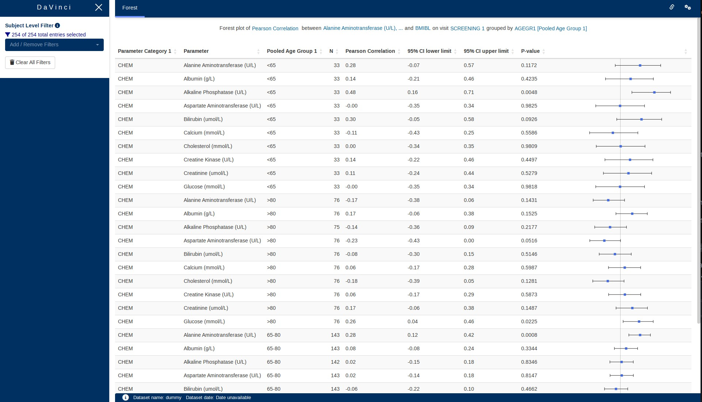
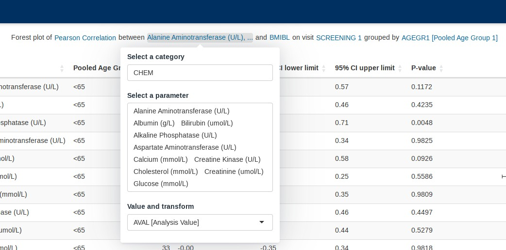
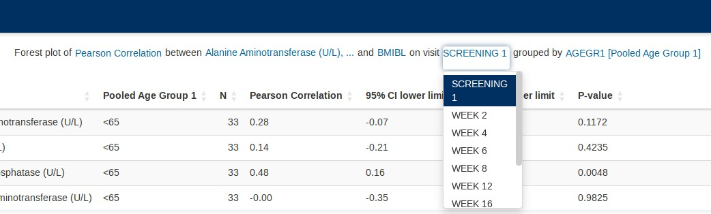
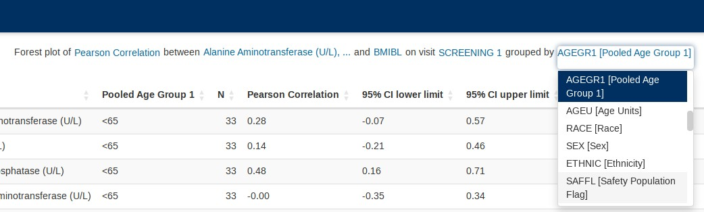

```{r, include = FALSE}
knitr::opts_chunk$set(
  collapse = TRUE,
  comment = "#>"
)
```

 

This guide provides guidance on creating Apps in DaVinci using the `forest` module.
Walk-throughs for sample app creation are also included to demonstrate various module-specific features.

The `forest` module displays a hybrid table/forest plot of arbitrary statistics (correlations, odds ratios, ...)
computed on dataset parameters over a single visit.

```{r include_child, child = '_common/_info.Rmd'}
```

# Features

The `forest` module offers the following features:

-   Table with results of applying arbitrary app-creator-supplied functions over pairs of parameters of a dataset.
-   Hover-on explanation of `NA` results on cells of that table.
-   Row-aligned plot depicting table results.

This module supports bookmarking.

# Module arguments

```{r, echo = FALSE}
forest_call <- paste0("`", devtools::as.package(".")$package, "::mod_forest()`")
```

The `r forest_call` module presents mandatory and optional function arguments to the app creator.

**Mandatory Arguments**

-   `module_id` : A unique identifier of type character for the module in the app.

-   `bm_dataset_name`: The dataset that contains the continuous parameters. It expects a dataset similar to
     https://www.cdisc.org/kb/examples/adam-basic-data-structure-bds-using-paramcd-80288192 ,
     1 record per subject per parameter per analysis visit.

    It should have, at least, the columns passed in the optional arguments,
    `subjid_var`, `cat_var`, `par_var`, `visit_var` and `value_vars`.    

-  `group_dataset_name`: 

    It expects a dataset with a structure similar to https://www.cdisc.org/kb/examples/adam-subject-level-analysis-adsl-dataset-80283806 , one record per subject
    It should have, at least, the column passed in the optional argument `subjid_var`.

-  `numeric_numeric_functions` and `numeric_factor_functions`: 

    The application creator can supply two lists of arbitrary functions through these arguments. 

    These functions will be applied to user-selected pair-wise combinations of parameters of `bm_dataset` and should 
    return four numeric values. Two of those values will be used to define the range of the "trees" of the forest plot, another one will mark the central
    value of each of them and the remaining value will only be shown as part of the table accompanying the plot.

    Example: Function that returns a correlation coefficient between to numerical parameters, along with upper and lower
    confidence intervals and a p-value.

    As the names of the arguments imply, `numeric_numeric_functions` apply to combination of numerical paramaters
    on the dataset, while `numeric_factor_functions` needs for one of them to be categorical and encoded as `factor`.


Refer to `r forest_call` for the complete list of arguments and their description.

# Input menus

Input menus are integrated as part of the figure title. Portions of the title are stylized as hyperlinks
and reveal the relevant pop-up menus when clicked.

 

 

 

 




# Hybrid table/plot

This visualizations consists of a table and a row-aligned forest plot. The plot makes it easier for the user to navigate
the data. Controls embedded in the table headings allow arbitrary reorderings of the table 
(e.g. ascending Pearson correlation coefficient shown in the following image).


# Creating a forest plot application

```{r, eval=FALSE}
adbm_dataset <- dplyr::mutate(
  dv.biomarker.general::adbm_example,
  USUBJID = factor(USUBJID),
  PARCAT1 = factor(PARCAT1),
  PARAM = factor(PARAM),
  AVISIT = factor(AVISIT)
)

adsl_dataset <- dplyr::mutate(
  dv.biomarker.general::adsl_example,
  USUBJID = factor(USUBJID)
)

fp_numeric_numeric_functions <- list(
  "Pearson Correlation" = dv.biomarker.general::pearson_correlation,
  "Spearman Correlation" = dv.biomarker.general::spearman_correlation
)
fp_numeric_factor_functions <- list(
  "Odds Ratio" = dv.biomarker.general::odds_ratio
)

dv.manager::run_app(
  data = list("DS" = list(adbm = adbm_dataset, adsl = adsl_dataset)),
  module_list = list(
    "Forest Plot" = dv.biomarker.general::mod_forest(
      "forestplot",
      bm_dataset_name = "adbm",
      group_dataset_name = "adsl",
      numeric_numeric_functions = fp_numeric_numeric_functions,
      numeric_factor_functions = fp_numeric_factor_functions,
      subjid_var = "USUBJID",
      cat_var = "PARCAT1"
    )
  ),
  filter_data = "adsl",
  filter_key = "USUBJID"
)
```
