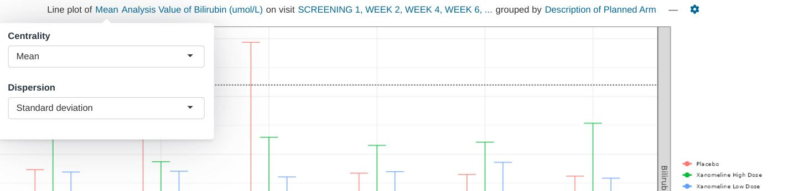
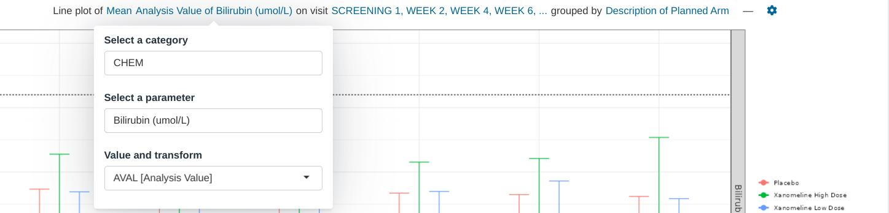
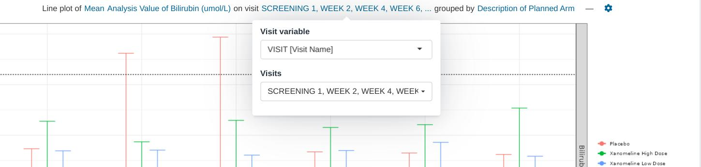
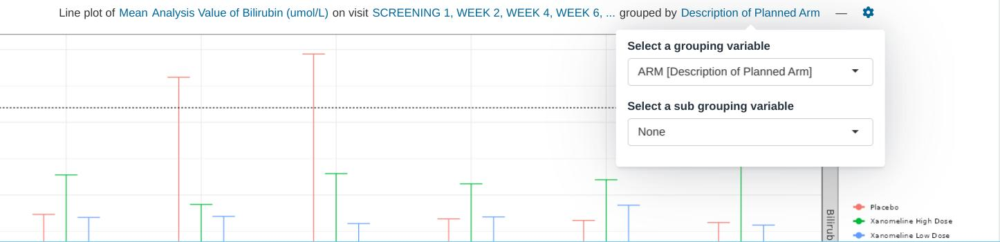
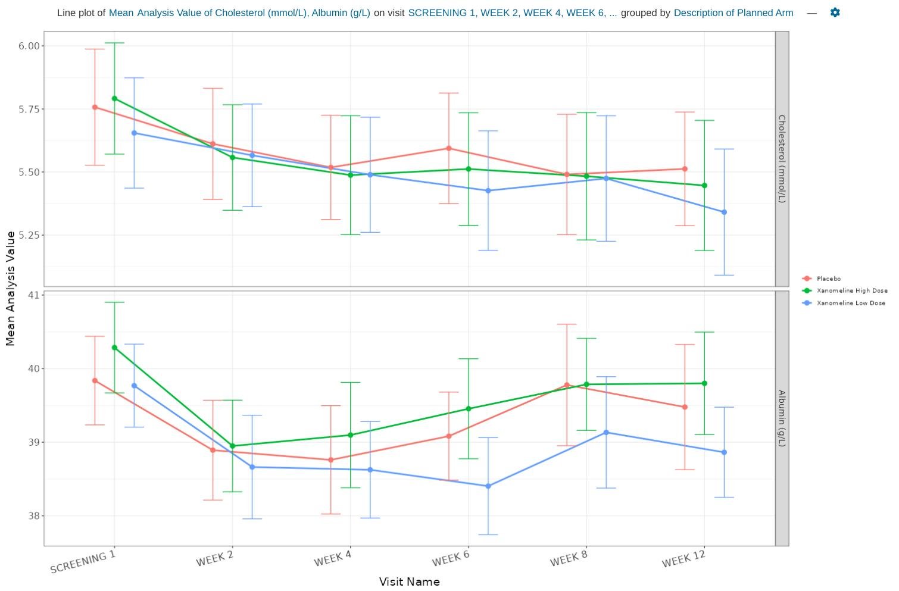
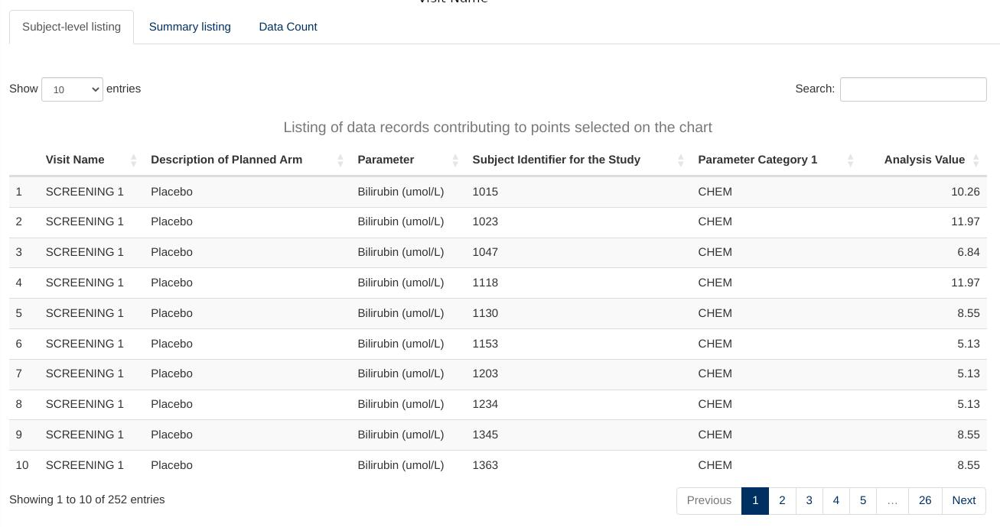
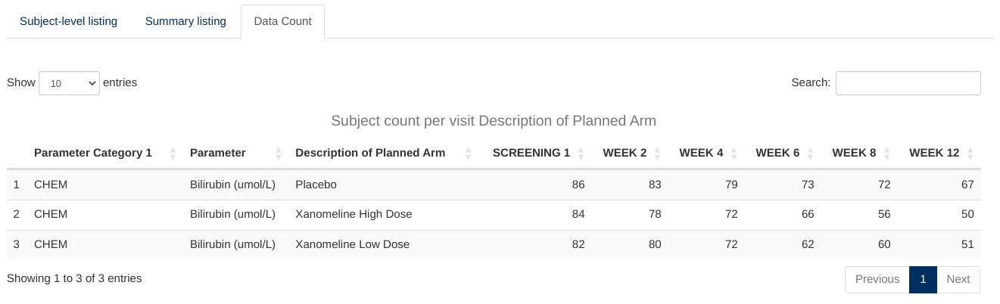

```{r, include = FALSE}
knitr::opts_chunk$set(
  collapse = TRUE,
  comment = "#>"
)
```

 

This guide provides guidance on creating Apps in DaVinci using the `lineplot` module.
Walk-throughs for sample app creation are also included to demonstrate various module-specific features.

The `lineplot` module displays line traces of raw or summary data over time. 
It also allows to inspect the data underlying each point on the plot through 
its "data listing" and "data count" tables.

```{r include_child, child = '_common/_info.Rmd'}
```

# Features

`lineplot` features the following plot and tables:

-   A sequence of lineplot charts that display raw or summaries of time series, optionally grouped 
  by up to two categorical variables. Built-in summary functions are mean and median, but this module
  also accepts user-supplied functions
-   A table that shows the data that contributes to the last points clicked or brushed in any of those charts
-   A table that provides the count of samples per group and time point.

This module supports bookmarking.

# Module arguments

```{r, echo = FALSE}
lineplot_call <- paste0("`", devtools::as.package(".")$package, "::mod_lineplot()`")
```

The `r lineplot_call` module presents mandatory and optional function arguments to the app creator.

**Mandatory Arguments**

-   `module_id` : A unique identifier of type character for the module in the app.

-   `bm_dataset_name`: The dataset that contains the continuous parameters. It expects a dataset similar to
     https://www.cdisc.org/kb/examples/adam-basic-data-structure-bds-using-paramcd-80288192 ,
     1 record per subject per parameter per analysis visit.

    It should have, at least, the columns passed in the arguments,
    `subjid_var`, `cat_var`, `par_var`, `visit_vars` and `value_vars`.    

-  `group_dataset_name`: 

    It expects a dataset with a structure similar to https://www.cdisc.org/kb/examples/adam-subject-level-analysis-adsl-dataset-80283806 , one record per subject
    It should have, at least, the column passed in the argument `subjid_var`.

Refer to `r lineplot_call` for the complete list of arguments and their description.

# Input menus

Input menus are integrated as part of the figure title. Portions of the title are stylized as hyperlinks
and reveal the relevant pop-up menus when clicked.

 

 

 

 


# Visualizations

## Lineplot

This visualization consists of a facetted lineplot based on the set of parameters and grouping variables.



# Listings

## Subject-level listing

A table containing the listing of the raw data contributing to the last clicked point or brushed set of points on a lineplot.

The single subject table contains a drill-down button that can be used to obtain more information about the subject.
This setting requires additional configuration through the `receiver_id` optional module argument.



## Summary listing

A table containing the listing of the summarized data correspoding to the last clicked point or brushed set of points on a 
lineplot in which a centrality summary function has been selected.


## Data count

A table that provides the count of samples per group and time point for the whole plot.



# Creating a lineplot application

```{r, eval=FALSE}

adbm_dataset <- dplyr::mutate(
  dv.explorer.parameter:::safety_data()[["bm"]],
  USUBJID = factor(USUBJID),
  PARCAT1 = factor(PARCAT1),
  PARAM = factor(PARAM),
  AVISIT = factor(AVISIT)
)

adsl_dataset <- dplyr::mutate(
  dv.explorer.parameter:::safety_data()[["sl"]],
  USUBJID = factor(USUBJID)
)

module_list <- list(
  "lineplot" = dv.explorer.parameter::mod_lineplot(
    module_id = "lineplot",
    bm_dataset_name = "adbm",
    group_dataset_name = "adsl",
    subjid_var = "USUBJID",
    cat_var = "PARCAT1",
    par_var = "PARAM",
    visit_vars = "AVISIT",
    value_vars = c("AVAL", "CHG"),
  )
)

dv.manager::run_app(
  data = list("DS" = list(adbm = adbm_dataset, adsl = adsl_dataset)),
  module_list = module_list,
  filter_data = "adsl",
  filter_key = "USUBJID"
)
```
