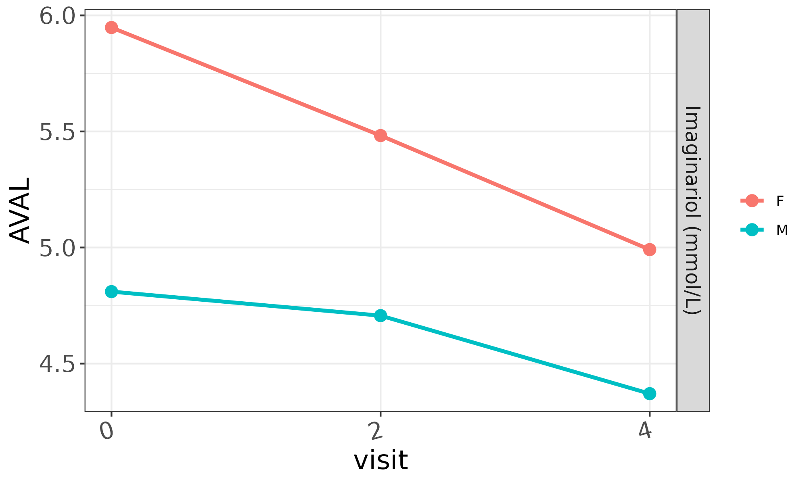
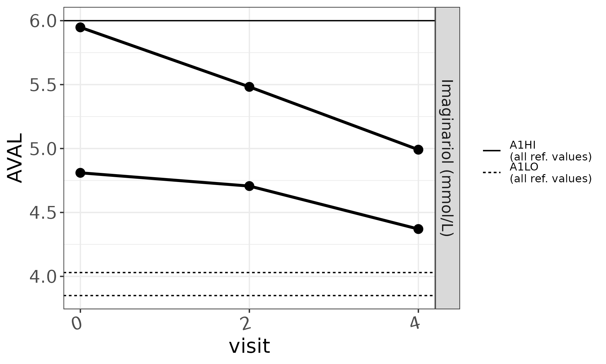

```{r, include = FALSE}
knitr::opts_chunk$set(
  collapse = TRUE,
  comment = "#>"
)
```

This article describes how to display reference values in `mod_lineplot` charts and discusses the not-so-intuitive
behavior of reference lines in the presence of grouped data.

# A basic plot

As a starting point, let's imagine we want to inspect the following tiny subject-level (`sl`) and laboratory values (`lb`) datasets (*click to expand*):

<details><summary>Subject-level dataset</summary>
```{r, echo = FALSE}
# Inspired in safetyData:adam_adsl
sl <- data.frame(
  SUBJID = c("1015", "1028") |> as.factor(),
  SEX = c("F", "M") |> as.factor(),
  RACE = c("WHITE", "WHITE") |> as.factor(),
  COUNTRY = c("Italy", "Spain") |> as.factor()
)
knitr::kable(sl, format = "markdown")
```
</details>

<details><summary>Laboratory values dataset</summary>
```{r, echo = FALSE}
# Inspired in safetyData:adam_lbc
lb <- data.frame(
  SUBJID = c("1015", "1015", "1015", "1028", "1028", "1028") |> as.factor(),
  PARCAT1 = rep("CHEM", 6) |> as.factor(),
  PARAM = rep("Imaginariol (mmol/L)", 6) |> as.factor(),
  AVISITN = c(0, 2, 4, 0, 2, 4),
  AVAL = c(5.94780, 5.48232, 4.99098, 4.80996, 4.70652, 4.37034),
  A1LO = c(4.03, 4.03, 4.03, 3.85, 3.85, 3.85),
  A1HI = c(6.00, 6.00, 6.00, 6.00, 6.00, 6.00)
)
knitr::kable(lb, format = "markdown")
```
</details>

```{r, echo = FALSE, eval = FALSE}
# Run this app to generate the plots
module_list <- list(
  lineplot = dv.explorer.parameter::mod_lineplot(
    module_id = "lineplot", bm_dataset_name = "lb", group_dataset_name = "sl",
    subjid_var = "SUBJID", cat_var = "PARCAT1", par_var = "PARAM", value_vars = "AVAL",
    visit_vars = "AVISITN", default_cat = "CHEM", default_par = "Imaginariol (mmol/L)",
    #default_main_group = "COUNTRY" # nolint
    , ref_line_vars = c("A1LO", "A1HI")
  )
)

dv.manager::run_app(
  data = list("DS" = list(lb = lb, sl = sl)),
  module_list = module_list,
  filter_data = "sl",
  filter_key = "SUBJID"
)
```

We can do so by configuring `mod_lineplot` thus:
 
```{r, eval=FALSE}
dv.explorer.parameter::mod_lineplot(
  module_id = "lineplot", bm_dataset_name = "lb", group_dataset_name = "sl",
  subjid_var = "SUBJID", cat_var = "PARCAT1", par_var = "PARAM", 
  value_vars = "AVAL", visit_vars = "AVISITN", default_cat = "CHEM", 
  default_par = "Cholesterol (mmol/L)", default_main_group = "SEX"
)
```

Which generates the following plot: 


# Grouped and ungrouped reference values

We can provide a value for the `ref_line_vars` parameter so that in points to one or more `lb` numerical columns holding reference values:
```{r, eval=FALSE}
dv.explorer.parameter::mod_lineplot(
  ..., default_main_group = "SEX", ref_line_vars = c("A1LO", "A1HI")
)
```

Which produces:

Examining this plot we can see the three distinct reference values available in the original `bm` dataset. There is a `A1HI` value 
common to all of our (two) subjects. It's indicated with a continuous black line. There are also two `A1LO` values that coincide with
our selected grouping. Since the plot already provides colors for those groups, `mod_lineplot` to also plot those lines in matching colors.

# Which demographic value dictates distinct reference values?

The original `bm` dataset does not tell us anything about origin of the different values of the `A1LO` reference values. It may very well be the case that `SEX` is indeed the variable that dictates which reference value to use but, in the absence of more information, `COUNTRY` would work equally well.

```{r, eval=FALSE}
dv.explorer.parameter::mod_lineplot(
  ..., default_main_group = "COUNTRY", ref_line_vars = c("A1LO", "A1HI")
)
```


This plot is still factually correct in the sense that the color of each `AVAL` line is color-matched with the `A1LO` value that accompanies it in the `lb` dataset.

# Disappearing reference lines

What happens then if we don't provide a grouping variable?

```{r, eval=FALSE}
dv.explorer.parameter::mod_lineplot(
  ..., ref_line_vars = c("A1LO", "A1HI")
)
```
In this case, `mod_lineplot` can't plot the `A1LO` reference values in a way that ties them to each of the two `AVAL` lines, so they are simply dropped:


Notice however, that the `A1HI` value keeps applying to all `AVAL` lines, so it is kept.

# Inspecting all reference values

Sometimes it's useful to be able to see *all* reference values regardless of whether they can be represented truthfully given some 
particular data grouping. In this case, users can override the built-in reference line filter by checking the "Show all reference values"
option under the "Settings" drop-down menu.


After doing that, all unique reference values are shown in black. The legend is also modified to point out the non-standard nature of the plot.



# Requirements for reference values

Reference value dataset variables should:

- be numerical
- remain constant across every combination of subject and parameter of the dataset

If one of these conditions is not met during module start-up, `mod_lineplot` produces a suitable message, such as:


