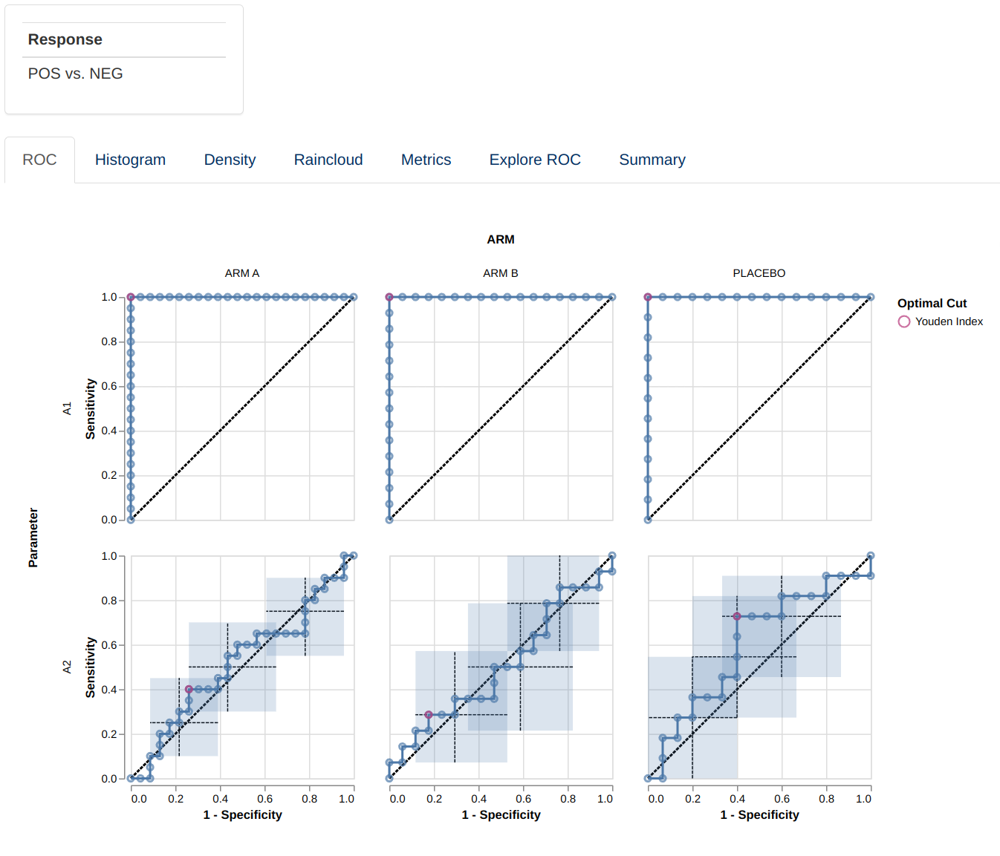
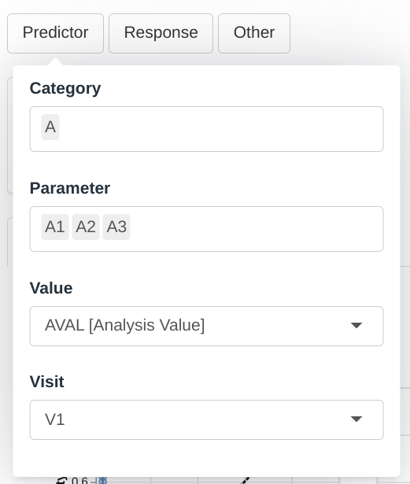
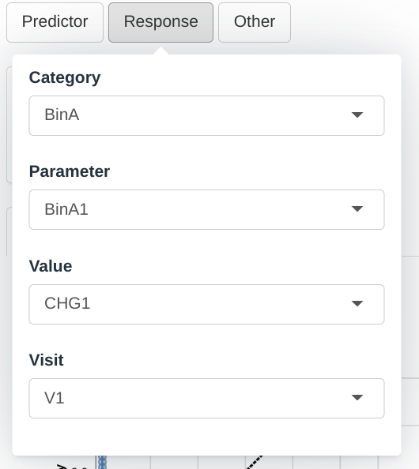
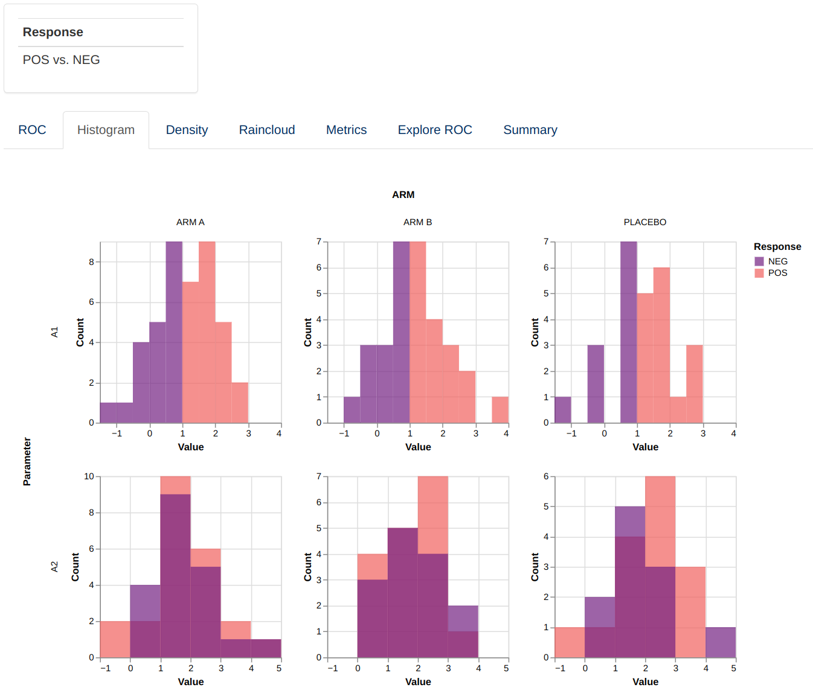
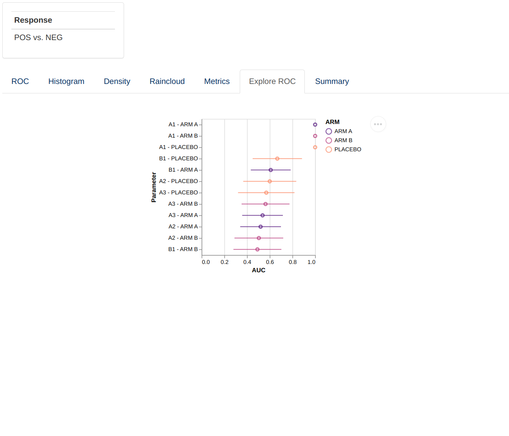
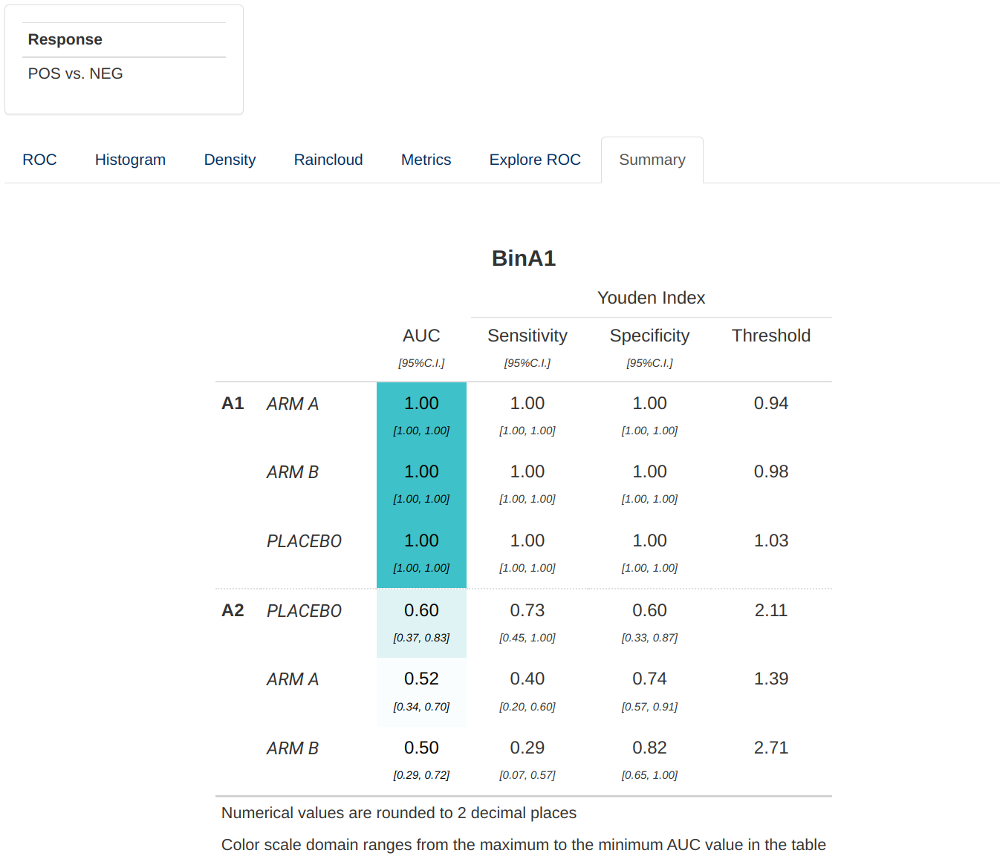

```{r, include = FALSE}
knitr::opts_chunk$set(
  collapse = TRUE,
  comment = "#>"
)
options(rmarkdown.html_vignette.check_title = FALSE)
```



This guide provides a detailed overview of the `dv.roc` module and its features. It is meant to provide guidance to
App Creators on creating Apps in DaVinci using the `dv.roc` module.
Walk-throughs for sample app creation using the module are also included
to demonstrate the various module specific features.

The `dv.roc` module makes it possible to visualize a set of ROC related charts
and compare independent ROC curves for different continuous parameters with respect to
a single binary endpoint. This allows a user
to evaluate how predictive is a continuous parameter of binary endpoint.

```{r include_child, child = '_common/_info.Rmd'}
```

<br>

# Features

`dv.roc` features the following plots:

-   A set of ROC curves
-   A set of histograms showing the distribution of the continuos parameter values
-   A set of probability density plots showing the distribution of the continuous parameter values
-   A set of raincloud plots showing the distribution of the continuous parameter values
-   A set of line plots showing metrics for the results of the classification
-   A point plot indicating the AUC for each parameter/parameter-group combination
-   A summary table for the ROC analysis

<br>

# Arguments for the module

`dv.roc::mod_roc()`
module uses several arguments with the following being mandatory and
the rest optional. As part of app creation, the app
creator should specify the values for these arguments as applicable.

**Mandatory Arguments**

-   `module_id` : A unique identifier of type character for the module
    in the app.

-   `subjid_var`: A common column across all datasets that uniquely identify subjects. By default: "SUBJID"

-   `pred_dataset_name`: The name of the dataset that contains the continuous parameters to be
    used as predictors in the ROC analysis. It expects a dataset similar to
     https://www.cdisc.org/kb/examples/adam-basic-data-structure-bds-using-paramcd-80288192 ,
     1 record per subject per parameter per analysis visit

    It expects, at least, the columns passed in the arguments, `subjid_var`, `pred_cat_var`, `pred_par_var`, `pred_visit_var` and `pred_value_var`.    

-   `resp_dataset_name`: The name of the dataset that contains the parameters to be
    used as responses/binary endpoints in the ROC analysis. It expects a dataset similar to
     https://www.cdisc.org/kb/examples/adam-basic-data-structure-bds-using-paramcd-80288192 ,
     1 record per subject per parameter per analysis visit

    It expects, at least, the columns passed in the arguments, `subjid_var`, `resp_cat_var`, `resp_par_var`, `resp_visit_var` and `resp_value_var`.

-  `group_dataset_name`: The name of the dataset that contains the variables that will be used to group plots in
    the module.

    It expects a dataset with an structure similar to https://www.cdisc.org/kb/examples/adam-subject-level-analysis-adsl-dataset-80283806 , one record per subject
    It expects to contain, at least, `subjid_var`.

Refer to `dv.roc::mod_roc()` for the complete list of arguments and their description.

# Input menus

  |  |  
--|--|--
 |  | 

A set of menus allows to select which parameters will be used as predictors for the response variable and customize the visualization in the module.

# Visualizations

## ROC

This visualizations consists of a facetted plot based on parameters and grouping variable. Each
plot represents a ROC curve with a set of confidence intervals (as defined in **Other** menu)and
optimal cut points (see `dv.roc::compute_roc()`). Hovering over the figure will show a tooltip providing
additional information for each of the points.

Facetting can be replaced by a Nx4 matrix of plots sorted by AUC.


## Histogram and Density

This visualizations consists of a facetted plot based on parameters and grouping variable. Each
plot represents a histogram or density plot for the values of each predictor parameter grouped and colored
based on the response value.

  |
--|--
 | 

## Raincloud

This visualization consists of a facetted plot based on parameters and grouping variable. Each
plot represents a raincloud plot for the values of each predictor parameter grouped and colored
based on the response value. The top part of the raincloud corresponds to a density plot, the bottom part
correspond to individual data points, and the markes between them correspond to %5, 25%, 50%, 75% and 95% quantiles.
Hovering over the figure will show a tooltip providing additional information for each of the points and markers.


## Metrics

This visualization consists of a facetted plot based on parameters and metrics and colored based on grouping. Each
plot represents a line graph indicating the performance of the classification with respect to the threshold use for classification.
The X axis can represent the score represented by the parameter value, raw, normalized or normalized and ranked.


## Explore

This visualization consists of a sorted lineplot representing the AUC and its confidence interval per parameter, or parameter and grouping.
All predictors parameters are represented regardless of the selection in the Predictor menu.



## Summary

This table summarizes the results of the ROC curves and its optimal cut points.




# Custom Compute Functions

This module provides the user with some default ROC analysis functions, nonetheless there are different approaches or preferences for different packages that performs
this type of analysis. Additionally, because it is a data derivation, the user is provided and in charge of checking those functions and calculations. For this purpose this
analysis functionality is isolated and can be modified and checked independently.

The default functions in charge of this calculations are `compute_roc_data()` and `compute_metric_data()`. But the user can create alternative functions,
for example for which metrics are presented. This can be done simply by writing another function
that have the same arguments and returns a similar data structure, see the documentation of the functions for further details.
Two helper functions `assert_compute_roc_data()` and `assert_compute_metric_data()` can be used to check that
the output of the user-defined function is correct (this checking is not exhaustive and is only prepared to catch common errors).


