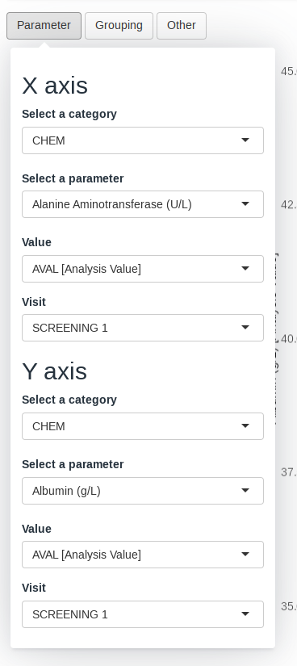

```{r, include = FALSE}
knitr::opts_chunk$set(
  collapse = TRUE,
  comment = "#>"
)
```


This guide provides a detailed overview of the `scatterplot` module and its features. It is meant to provide guidance to
App Creators on creating Apps in DaVinci using the `scatterplot` module.
Walk-throughs for sample app creation using the module are also included
to demonstrate the various module specific features.

The `scatterplot` module makes it possible to visualize a scatterplot of two biomarkers with different levels of
grouping.

```{r include_child, child = '_common/_info.Rmd'}
```

# Features

`scatterplot` features the following plot and tables:

-   A scatterplot with different custom groupings showing a regression line.
-   A table showing the population listing of the selected points in the chart.
-   A table showing summary data about the regression and correlation between the parameters

It supports bookmarking.

# Arguments for the module

`dv.biomarker.general::mod_scatterplot()`
module uses several arguments with the following being mandatory and
the rest optional. As part of app creation, the app
creator should specify the values for these arguments as applicable.

**Mandatory Arguments**

-   `module_id` : A unique identifier of type character for the module
    in the app.

-   `subjid_var`: A common column across all datasets that uniquely identify subjects. By default: "SUBJID"

-   `bm_dataset_name`: The dataset that contains the continuous parameters. It expects a dataset similar to
     https://www.cdisc.org/kb/examples/adam-basic-data-structure-bds-using-paramcd-80288192 ,
     1 record per subject per parameter per analysis visit

    It expects, at least, the columns passed in the arguments,
    `subjid_var`, `cat_var`, `par_var`, `visit_var` and `value_vars`.    

-  `group_dataset_name`: 

    It expects a dataset with an structure similar to https://www.cdisc.org/kb/examples/adam-subject-level-analysis-adsl-dataset-80283806 , one record per subject
    It expects to contain, at least, `subjid_var`

Refer to `dv.biomarker.general::mod_scatterplot()` for the complete list of arguments and their description.

# Input menus

  |  |  
--|--|--
 |  | 

A set of menus allows to select a set of parameters, groupings and settings of the visualization.

# Visualizations

## Scatterplot

This visualization consists of a scatterplott based on the set of parameters and grouping variable. The chart includes
an orientative regression line with 95% C.I. 


# Tables

## Population listing

A table containing a listing of the population selected by brushing in the scatterplot.


## Estimates table

A table containing a set of statistics regarding the regression and correlation.


# Creating a boxplot application

```{r, eval=FALSE}
adbm_dataset <- dv.biomarker.general::adbm_example %>%
  dplyr::mutate(
    USUBJID = factor(USUBJID),
    PARCAT1 = factor(PARCAT1),
    PARAM = factor(PARAM),
    AVISIT = factor(AVISIT)
  )

adsl_dataset <- dv.biomarker.general::adsl_example %>%
  dplyr::mutate(USUBJID = factor(USUBJID))

dv.manager::run_app(
  data = list(dummy = list(adbm = adbm_dataset, adsl = adsl_dataset)),
  module_list = list(
    Scatterplot = dv.biomarker.general::mod_scatterplot(
      "scatterplot",
      bm_dataset_name = "adbm",
      group_dataset_name = "adsl",
      subjid_var = "USUBJID",
      cat_var = "PARCAT1"
    )
  ),
  filter_data = "adsl",
  filter_key = "USUBJID"
)
```

