```{r, include = FALSE}
knitr::opts_chunk$set(
  collapse = TRUE,
  comment = "#>"
)
```

```{r, include = FALSE}
knitr::opts_chunk$set(
  collapse = TRUE,
  comment = "#>"
)
options(rmarkdown.html_vignette.check_title = FALSE)
```

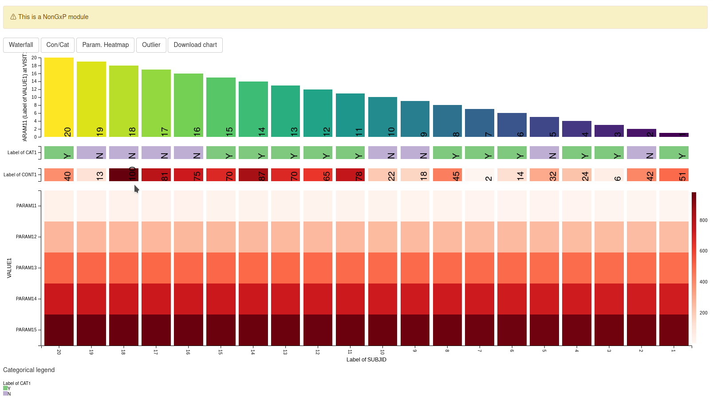

This guide provides a detailed overview of the **Waterfall plus Heatmap
(WfpHm)** module and its features. It is meant to provide guidance to
App Creators on creating Apps in DaVinci using the WfpHm module.
Walk-throughs for sample app creation using the module are also included
to demonstrate the various module specific features.

The **WfpHm** module makes it possible to visualize an appropriate
variable of choice in a waterfall plot(bar chart sorted in descending
order of the visualized variable from left to right) and simultaneously
visualize one or more additional variables in different heat-maps that
share the same common X-Axis with the Waterfall plot. This allows a user
to find relations between the variables represented in the waterfall
plot and the heatmaps to look for patterns.

```{r include_child, child = '_common/_info.Rmd'}
```

# Features

WfpHm features the following four different plots:

-   A waterfall plot
-   A categorical heatmap
-   A continuous heatmap
-   A parameter heatmap

The intended usage of the plot is to find relations between a variable
represented in the waterfall plot and the heatmaps.

The main feature of the module is the order of the variable values in
the **X** axis which is common and shared across all plots. The order is
determined based on the variable visualized in the waterfall plot
starting from left with the one having the largest value for the
variable in the waterfall plot. The variable on the X-Axis is based on
the value specified for the "`subjid_var"` argument for the module.
Typically it is expected to be "Subject ID" and hence the naming
convention for the argument reflects this and the default value for the
argument is set to "USUBJID". However please note that the module will
support other suitable variables on the X-Axis as well if it is
specified as the argument value.

The variable visualized in the waterfall plot can be changed dynamically
as the module allows the user to select it from the available variables
in the dataset. By selecting different variables one can observe if the
rest of the plots follow a particular pattern.

<br>

# Mandatory Arguments for the module

[dv.explorer.parameter::mod_wfphm()] module uses several arguments with the following two being mandatory and
the rest optional. Some of the optional As part of app creation, the app
creator should specify the values for these arguments as applicable.

**Mandatory Arguments**

-   `module_id` : A unique identifier of type character for the module
    in the app.

-   `bm_dataset_name` : The name of dataset contains the variables to be
    displayed on the waterfall and parameter heatmap plots in the WfpHm module.
    The dataset should at
    least have the columns with names specified for the *cat_var*,
    *par_var*, *value_vars*, *visit_var* and *subjid_var* optional
    arguments. The default values for these optional arguments if not
    specified are defined below.

    -   `cat_var`: "PARCAT1"
    -   `par_var`: "PARAM"
    -   `value_vars`: One or more columns with names "AVAL" or "CHG" or
        "PCHG" or "log2AVAL" or "log2CHG" or "log2PCHG" or "log10AVAL"
        or "log10CHG", "log10PCHG"
    -   `visit_var`: "AVISIT"
    -   `subjid_var`: "USUBJID"

-   `group_dataset_name` : The name of dataset used to define groups in the waterfall plot and the variables
    to be displayed in the continuous and categorical heatmaps.

    The dataset should at least have the columns with names:
    -   `subjid_var`: "USUBJID"

Refer to
`dv.explorer.parameter::mod_wfphm()` for the complete list of arguments and their description.

# Input dataset

The `mod_wfphm` module is designed to work with [ADaM Basic Data Structure
(BDS) using
PARAMCD](https://www.cdisc.org/kb/examples/adam-basic-data-structure-bds-using-paramcd-80288192).
The default values of arguments for the module matches the naming of
this standard dataset.

Nonetheless:

-   Other names can also be specified in the arguments of the module. So
    the module can work with other datasets with similar data structures
    but having different names.
-   Not all columns in the mentioned data structure are compulsory.
    Refer to the "Mandatory Arguments" section above for details on the
    columns that are compulsory.

## Example dataset

We will be using a simple dataset defined below for most of our examples
to illustrate the basic features of the module. More complex ones will
be created in the later part of the guide to describe additional
features of the module.

This example datasets includes only a subset of the columns from the ADaM
standard dataset mentioned above.

```{r}
example_dataset <- list(
  "adbm" = tibble::tibble(
    USUBJID = factor(c(1, 1, 2, 2, 3, 3)),
    PARCAT1 = factor(c("PC1", "PC2", "PC1", "PC2", "PC1", "PC2")),
    PARAM = factor(c("P1", "P2", "P1", "P2", "P1", "P2")),
    AVISIT = factor(c("V1", "V2", "V1", "V2", "V2", "V1")),
    AVAL = c(11, 12, 21, 22, 31, 3)
  ),
  "adsl" = tibble::tibble(
    USUBJID = factor(c(1, 2, 3)),
    WEIGHT = c(10, 20, 30),
    SEX = factor(c("M", "F", "U")),
    COUNTRY = factor(c("DE", "US", "DE"))
  )
)
```

``` {r}
DT::datatable(example_dataset[["adsl"]], rownames = FALSE)
```

``` {r}
DT::datatable(example_dataset[["adbm"]], rownames = FALSE)
```

# Module Features using Example

An app containing only the WfpHm module can be created using the below
code. The example dataset created above is used as the input dataset for
this app.

```{r, eval = FALSE}
module_list <- list(
  "WFPHM" = dv.explorer.parameter::mod_wfphm(
    module_id = "wfphm",
    bm_dataset_name = "adbm",
    group_dataset_name = "adsl"
  )
)

dv.manager::run_app(
  data = list(DS = example_dataset),
  module_list = module_list,
  filter_data = "adsl",
  filter_key = "USUBJID"
)
```

## Menus

Each plot in the module is driven by selections made under the
corresponding menu at the top. Various options to select the variables
to be plotted are available from the menu.

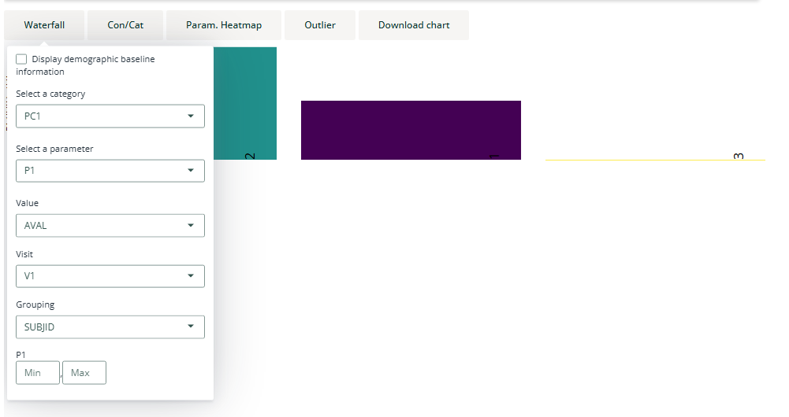{width="100%"}

Menus in this module are data-driven when possible, this means that
their content changes depending on the content of the dataset.

Let's review each plot and its respective menu to see what are their
contents and how they relate to the dataset.

## Waterfall plot

This plot shows a bar chart representing the value of a variable per
subject in the adbm dataset in descending order. The variable shown in the
plot is selected from the waterfall menu option

### Plotting columns

::: {style="display: flex;"}
<div>

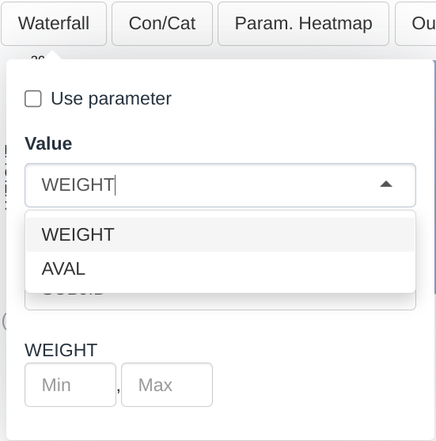{width="50%"}

</div>

<div>

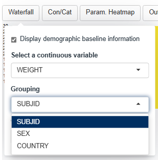{width="50%"}

</div>
:::

Dropdown menus for this plot are filled up the following way:

-   The *Value* dropdown will contain all the columns in the bm dataset
    that are numerical
-   The *Grouping* dropdown will contain all the columns in the group dataset
    that are categorical

As per the selections made in the screenshot above:

-   The height of the bar in the chart represent the value of the
    *WEIGHT* variable for each participant
-   Each bar is colored and labelled according to the *SUBJID*. We can
    change this selection for a more meaningful one, for example
    *COUNTRY*

### Plotting parameters

The [ADaM Basic Data Structure (BDS) using
PARAMCD](https://www.cdisc.org/kb/examples/adam-basic-data-structure-bds-using-paramcd-80288192)
is used to store parameter values for a given subject across several
visits. Any of these parameters can also be selected to be plotted in
the waterfall. To do so the *"Use Parameters"* check box in the menu
should be checked.

::: {style="display: flex;"}
<div>

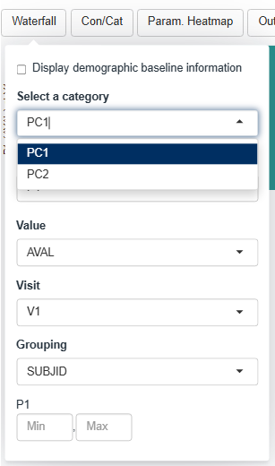{width="75%"}

</div>

<div>

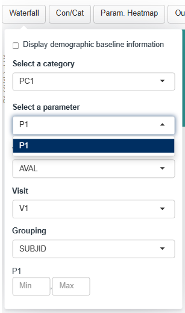{width="75%"}

</div>

<div>

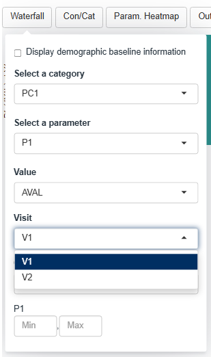{width="75%"}

</div>
:::

Checking the *"Use Parameter"* box at the top of the menu changes the
set of avaliable dropdown menus.

Dropdown menus are filled up in the following way:

-   The *Category* dropdown will contain all the factor levels in the
    *PARCAT1* column.
-   The *Parameter* dropdown will contain all the factor levels in the
    *PARAM* column whose corresponding *PARCAT1* is selected in the
    *Category* menu.
-   The *Value* dropdown will contain a subset of the numerical columns
    in the dataset. We will cover this menu in a subsequent section.
-   The *Visit* dropdown will contain all the factor levels in the
    *AVISIT* column.

According to the selections made in the screenshot:

-   The height of the bar will represent the value of:
    -   the *P1* parameter which is listed under the *PC1* category
    -   as listed in the *AVAL* column
    -   for the visit *V1*
    -   for each participant
-   As in the previous section, each bar is colored and labelled
    according to the *SUBJID*
-   A gray line is shown for participant 3 value because that particular
    *Parameter*, *Visit*, *Value* combination is missing

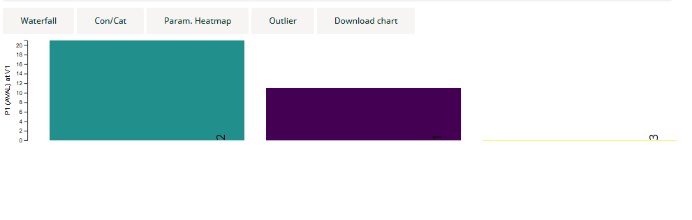{width="100%"}

### The Value Dropdown

Plotting parameters requires selecting the numerical columns that
represent the parameter values, usually *AVAL* represents the raw value.
But deriving new values is quite common for example *Change from
Baseline* or transformation of the value such as logarithms.

By default, the module have a list of common parameter value columns that,
if present in the dataset, will appear in the menu (e.g.: "AVAL", "CHG"
or "PCHG". See `dv.explorer.parameter::wfphm_server` for a full list)

But if a custom column is derived we can modify the call to the module
so it is included in the menu as seen in the example below.

```{r, eval = FALSE}
# Lets create a new custom
example_dataset_custom_aval <- example_dataset
example_dataset_custom_aval[["adbm"]][["CUSTOM_AVAL"]] <- example_dataset_custom_aval[["adbm"]][["AVAL"]] + 100

module_list_custom_aval <- list(
  "WFPHM" = dv.explorer.parameter::mod_wfphm(
    module_id = "wfphm",
    value_vars = c("CUSTOM_AVAL"), # We have added this argument
    bm_dataset_name = "adbm",
    group_dataset_name = "adsl"
  )
)
dv.manager::run_app(
  data = list(DS = example_dataset_custom_aval),
  module_list = module_list_custom_aval,
  filter_data = "adbm",
  filter_key = "USUBJID"
)
```

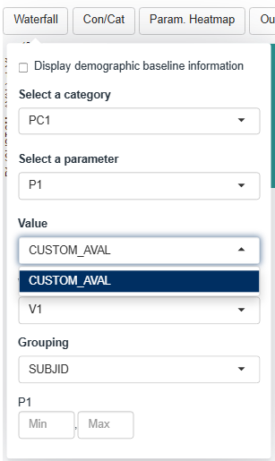{width="25%"}

The new argument in the module call indicates that *CUSTOM_AVAL* is a
column that contains values associated to parameters and is therefore
included in the menu. The previous *AVAL* no longer appear in the menu,
that happens because specifying a new column overrides the default
columns. If one is specified then all should be specified.

```{r, eval = FALSE}
module_list_custom_aval <- list(
  "WFPHM" = dv.explorer.parameter::mod_wfphm(
    module_id = "wfphm",
    value_vars = c("AVAL", "CUSTOM_AVAL"), # We have added this argument
    bm_dataset_name = "adbm",
    group_dataset_name = "adsl"
  )
)

dv.manager::run_app(
  data = list(DS = example_dataset_custom_aval),
  module_list = module_list_custom_aval,
  filter_data = "adbm",
  filter_key = "USUBJID"
)
```

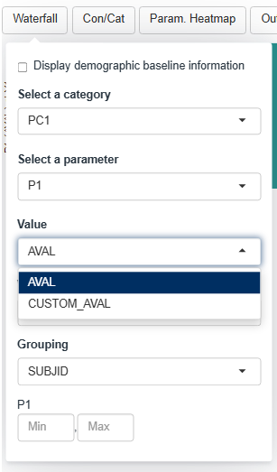{width="25%"}

## Outliers menu

At the bottom of the waterfall menu we can define which values are
considered outliers. The outliers will be colored in gray and labelled
accordingly.

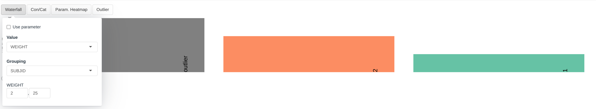{width="100%"}

## Continuous and categorical heatmap

The two plots immediately below the waterfall plot are the categorical
and a continuous heatmaps.

### Categorical heatmap

Dropdown menu is filled up the following way:

-   The *Categorical* dropdown will contain all the columns in the
    group dataset that are categorical

As per the selections made in the screenshot:

-   In the first row the value of the column *SEX* for each participant
    is displayed where each cell is labelled and colored accordingly.
-   In the second row the value of the column *COUNTRY* for each
    participant is displayed where each cell is labelled and colored
    accordingly.

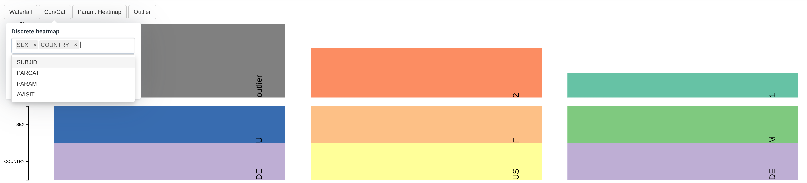{width="100%"}

### Continuous heatmap

Dropdown menus is filled up the following way:

-   The *Continuous* dropdown will contain all the columns in the
    group dataset that are numerical

As per the selections made in the screenshot:

-   In the first row the value of the column *WEIGHT* for each
    participant is displayed where each cell is labelled and colored
    accordingly

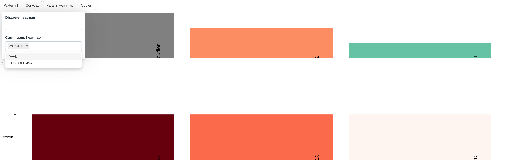{width="100%"}


## Parameter heatmap

The last plot is the parameter heatmap that plots a heatmap where the
rows represent different parameters.

The menus in this plot follow similar rules to those presented in the 
Plotting Parameter section in the Waterfall plot with the difference
that the *Category* and *Parameter* menus now accept selecting multiple values.
The *Transformation* menu will be covered in a separate section below.

{width="100%"}

Therefore according to the present selection we are observing:

-   In the first row the color of the cell represents the value of:
    -   the *P1* parameter which is listed under the *PC1* category
    -   as listed in the *AVAL* column
    -   for the visit *V1*
    -   for each participant
-   In the second row the color of the cell represents the value of:
    -   the *P2* parameter which is listed under the *PC2* category
    -   as listed in the *AVAL* column
    -   for the visit *V1*
    -   for each participant
-   Missing values are grayed out

## Outlier menu

The parameter heatmap works similarly to that described in the Waterfall
plot with the only difference that, because several parameteres can be
shown in this heatmap, a different outlier range can be defined for each
parameter.

### The Transformation Dropdown Menu

The transformation menu offers several possible data transformation such
as Z-score or Min-Max. The transformation is applied to each parameter
(i.e. to each row of the heatmap) independently.

::: {style="padding: 1em 1em 1em 1em;  margin-bottom: 5px;  border: 1px solid #64a1ce;  border-radius: 5px;  background:#f5f5f5 5px center/3em no-repeat;"}
{width="4%"} **Note** Outliers definition, described in the previous section, does
not affect the calculation of the transformations
:::

<br>

{width="25%"}

By default, the module include several transformation (See
`dv.explorer.parameter::wfphm_server` for a full list) but the user can include
custom transformations if needed for their data. The function is applied
to each row independently, meaning the function receives a vector with
all the values from a row and it must returned a similar vector with the
transformed values.

```{r, eval = FALSE}
module_list_custom_transformation <- list( # nolint
  "WFPHM" = dv.explorer.parameter::mod_wfphm(
    module_id = "wfphm",
    tr_mapper = list( # New argument
      "Original" = dv.explorer.parameter::tr_identity,
      "Mean Centered" = function(x) {
        x - mean(x)
      }
    ),
    bm_dataset_name = "adbm",
    group_dataset_name = "adsl"
  )
)

dv.manager::run_app(
  data = list(DS = example_dataset),
  module_list = module_list_custom_transformation,
  filter_data = "adbm",
  filter_key = "USUBJID"
)
```

{width="25%"}

## Using column labels in the menus

When the menu entries reference a column in the dataset, we can decorate
the entries by setting a label attribute for the columns.

```{r, eval = FALSE}
# Assign some labels to the dataset
example_dataset_labelled <- example_dataset
attr(example_dataset_labelled[["adbm"]][["USUBJID"]], "label") <- "Subject ID"
attr(example_dataset_labelled[["adbm"]][["SEX"]], "label") <- "Subject Sex"
attr(example_dataset_labelled[["adbm"]][["PARCAT1"]], "label") <- "Parameter Category"

dv.manager::run_app(
  data = list(DS = example_dataset_labelled),
  module_list = module_list,
  filter_data = "adbm",
  filter_key = "USUBJID"
)
```

## Custom column names

As mentioned described in the previous section, though this module is
designed to work with [ADaM Basic Data Structure (BDS) using
PARAMCD](https://www.cdisc.org/kb/examples/adam-basic-data-structure-bds-using-paramcd-80288192),
it can also be used generally with non-standard datasets that have a
similar structure.

For example, consider the below example where a dataset with different
column names is created and used for a app with this module. As you can
notice, the non standard column names are used as the values for
applicable module arguments.

```{r, eval = FALSE}
adbm_dataset <- dv.explorer.parameter:::safety_data()[["bm"]] %>%
  dplyr::mutate(
    USUBJID = factor(USUBJID),
    PARCAT1 = factor(PARCAT1),
    PARAM = factor(PARAM),
    AVISIT = factor(AVISIT)
  )

adsl_dataset <- dv.explorer.parameter:::safety_data()[["sl"]] %>%
  dplyr::mutate(USUBJID = factor(USUBJID))
module_list <- list(
  "WFPHM" = dv.explorer.parameter::mod_wfphm(
    module_id = "wfphm",
    bm_dataset_name = "adbm",
    group_dataset_name = "adsl",
    cat_var = "PARCAT1",
    par_var = "PARAM",
    visit_var = "AVISIT",
    subjid_var = "USUBJID",
    value_vars = "AVAL",
  )
)

dv.manager::run_app(
  data = list(dummy = list(adbm = adbm_dataset, adsl = adsl_dataset)),
  module_list = module_list,
  filter_data = "adsl",
  filter_key = "USUBJID" # We changed this one too, see dv.manager filtering doc for this change
)
```
